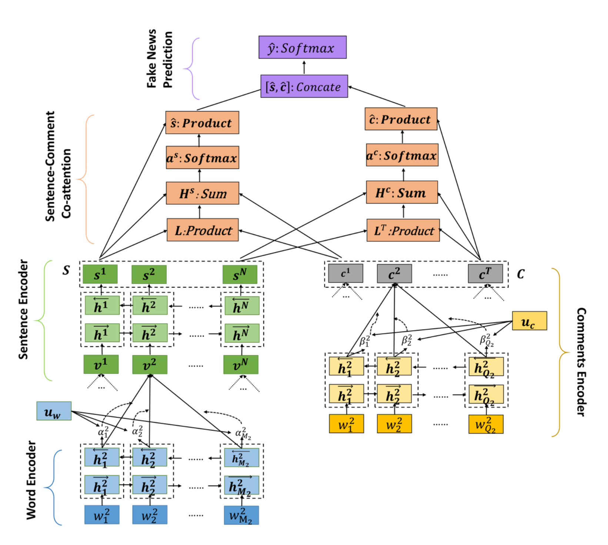

# defend-pytorch
Fake news detector using the "wisdom of the crowd", i.e. the related tweets of the news. This is a pytorch implementation of the following paper: [dEFEND: Explainable Fake News Detection](https://doi.org/10.1145/3292500.3330935).

The neural network is mainly composed of two attention mechanisms, which are:

- HAN from [Hierarchical Attention Networks for Document Classification](https://doi.org/10.18653/v1/N16-1174)
- Co-attention from [Hierarchical Question-Image Co-Attention for Visual Question Answering](https://doi.org/10.48550/arXiv.1606.00061)



Structure with using glove embedding matrix as encoder:
```
>>> print(model)
Defend(
  (content_encoder): GloveEncoder(
    (gru): GRU(100, 100, batch_first=True, bidirectional=True)
    (attention): AttLayer()
    (embedding): Embedding(400002, 100, padding_idx=400000)
  )
  (comment_encoder): GloveEncoder(
    (gru): GRU(100, 100, batch_first=True, bidirectional=True)
    (attention): AttLayer()
    (embedding): Embedding(400002, 100, padding_idx=400000)
  )
  (content_sentences_gru): GRU(200, 100, batch_first=True, bidirectional=True)
  (llayer): LLayer()
  (linear): Linear(in_features=400, out_features=2, bias=True)
  (softmax): Softmax(dim=1)
)
```
## Setup
```
$ python -V
Python 3.9.6
$ pip install -r requirements.txt
```
Download the following files and move them in the correspondent directory:

| File                                                                                                                | Location                                             |
|---------------------------------------------------------------------------------------------------------------------|------------------------------------------------------|
| [glove.6B.100d.txt](https://nlp.stanford.edu/projects/glove/)                                                       | `./data/glove/glove.6B.100d.txt`                     |
| [politifact-titles](https://github.com/cuilimeng/dEFEND-web/blob/master/static/politifact_title_no_ignore.tsv)      | `./data/politifact/politifact_titles_no_ignore.tsv`  |
| [politifact-content](https://github.com/cuilimeng/dEFEND-web/blob/master/static/politifact_content_no_ignore.tsv)   | `./data/politifact/politifact_content_no_ignore.tsv` |
| [politifact-comments](https://github.com/cuilimeng/dEFEND-web/blob/master/static/politifact_comment_no_ignore.tsv)  | `./data/politifact/politifact_comment_no_ignore.tsv` |

Some configuration variables can be changed in `./params.py`
## Run
```
$ python main.py --encoder glove  # [glove, bert]
```